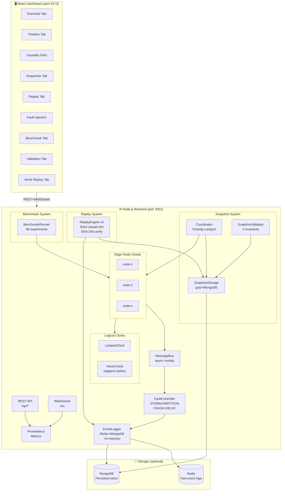
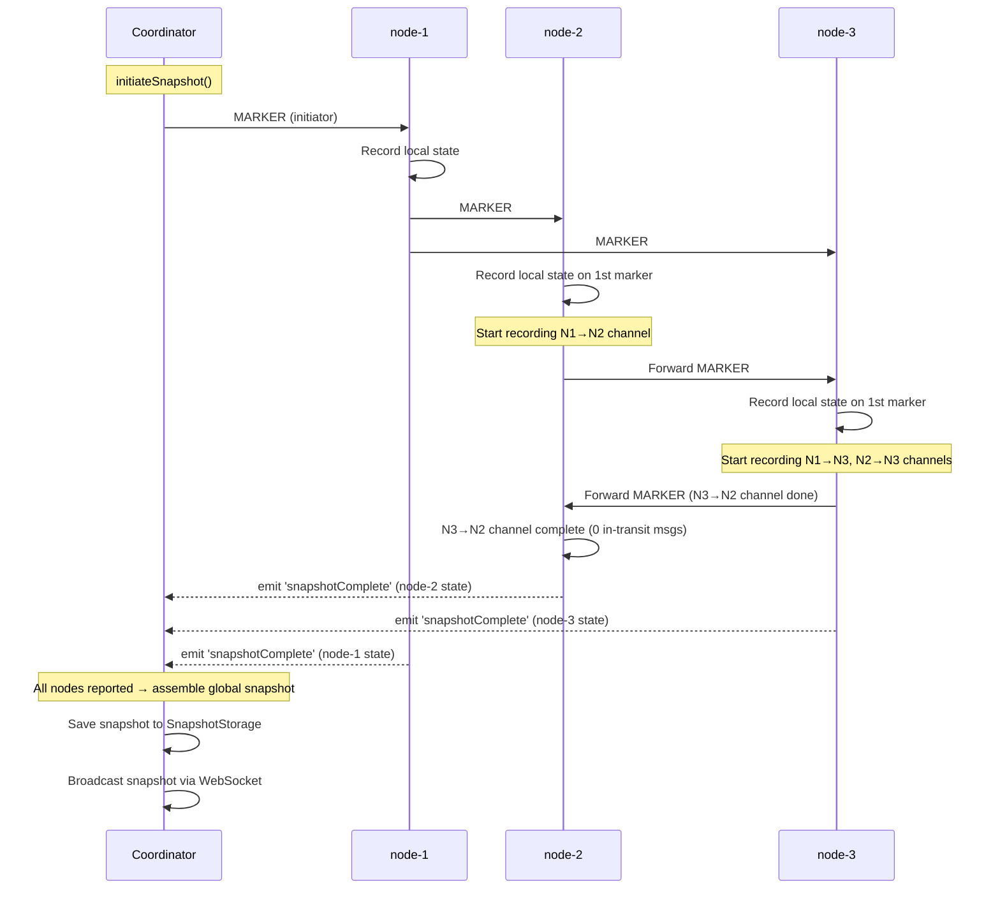
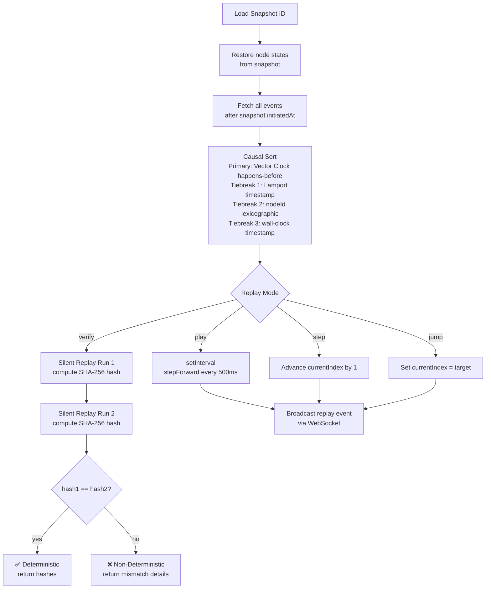

# Research Documentation — Distributed Snapshot & Time-Travel Debugging System

## A. Architecture Overview



---

## B. Chandy-Lamport Snapshot Flow



---

## C. Deterministic Replay Flow



---

## D. Benchmark Results (Interpretation)

The benchmark matrix runs **48 experiments** (4 node counts × 3 message rates × 4 fault scenarios).

### Expected Trends

| Dimension | Expected Observation |
|-----------|---------------------|
| **Latency vs Node Count** | Super-linear growth due to O(n²) marker messages in Chandy-Lamport |
| **Latency with crash fault** | Higher variance; some snapshots may timeout and retry |
| **Latency with delay fault** | Linear increase proportional to injected delay × hop count |
| **Replay time vs rate** | Higher rates → more events to sort → O(n log n) replay time |
| **Memory usage** | Grows with event log size; in-memory fallback avoids GC pressure |

### Benchmark API

```bash
# Start full benchmark (background)
curl -X POST http://localhost:3001/api/benchmark/run

# Poll progress
curl http://localhost:3001/api/benchmark/status

# Fetch results with chart data
curl http://localhost:3001/api/benchmark/results

# Download CSV
curl http://localhost:3001/api/benchmark/csv -o results.csv

# Or run standalone CLI
node backend/scripts/runExperiments.js --quick
```

---

## E. System Guarantees

### Consistency Guarantees

| Guarantee | Mechanism | Verified By |
|-----------|-----------|-------------|
| **Cut consistency** | Chandy-Lamport marker protocol | SnapshotValidator |
| **No missing messages** | Channel recording between first marker and own marker | `CHANNEL_MSG_NO_SEND` check |
| **No duplicate messages** | Each channel recorded exactly once | `DUPLICATE_MESSAGE` check |
| **Causal ordering** | Vector clock happens-before + Lamport tiebreaker | ReplayEngine `_causalSort()` |

### Determinism Guarantees

> **Theorem**: Given the same initial snapshot S and event sequence E, the replay engine produces identical final state F every time.

This holds because:

1. **Initial state** is exactly reproduced from snapshot (deterministic deserialization)
2. **Event sequence** is sorted by a **total order** (VC → Lamport → **nodeId** → timestamp)
   - The nodeId tiebreaker is the critical addition that makes concurrent events deterministically ordered
3. **No runtime randomness** enters replay (all non-deterministic inputs occurred during original execution and are captured in event logs)
4. **Hash verification** (`POST /replay/verify`) proves determinism by running replay twice

### Limitations

| Limitation | Impact | Mitigation |
|------------|--------|------------|
| In-process simulation | Not production gRPC/TCP | Replace MessageBus with gRPC adapter |
| Wall-clock timestamps for tiebreak | Machine clock skew | Use logical timestamps exclusively |
| Snapshot coordinator is centralized | Single point of failure | Extend with multi-coordinator leader election |
| No persistent benchmark history across restarts | Results lost if Redis down | Benchmark results written to disk JSON |
| D3 visualizations cap events at 500 for performance | Very long runs show partial timeline | Implement event windowing |

---

## F. API Quick Reference

| Endpoint | Method | Description |
|----------|--------|-------------|
| `/api/snapshot` | POST | Trigger Chandy-Lamport snapshot |
| `/api/snapshot/validate/:id` | POST | Validate invariants on snapshot |
| `/api/snapshot/validate-all` | GET | Validate all stored snapshots |
| `/api/replay/verify` | POST | SHA-256 determinism verification |
| `/api/faults/scenario` | POST | Activate STORM / CRASH_DURING_SNAPSHOT / DELAYED_MARKERS / PARTITION |
| `/api/benchmark/run` | POST | Launch full benchmark matrix |
| `/api/benchmark/results` | GET | Fetch results + chart data |
| `/api/benchmark/csv` | GET | Download results as CSV |
| `/api/benchmark/status` | GET | Current benchmark progress |

---

## G. Experiment Automation

```bash
# Full matrix (48 experiments, ~5-8 min)
node backend/scripts/runExperiments.js

# Quick matrix (8 experiments, ~1 min)
node backend/scripts/runExperiments.js --quick

# Output files:
# backend/data/experiment_results.json  — full JSON with chart data
# backend/data/results.csv              — CSV for Excel/Python plotting
# backend/data/benchmark_results.json  — used by API /benchmark/results
```

### Plotting with Python (example)

```python
import pandas as pd
import matplotlib.pyplot as plt

df = pd.read_csv('backend/data/results.csv')

# Latency vs node count
df.groupby('nodeCount')['snapshotLatencyMs'].mean().plot(kind='bar', title='Snapshot Latency vs Nodes')
plt.show()

# Replay by fault scenario  
df.groupby('faultScenario')['replayTimeMs'].mean().plot(kind='bar', title='Replay Time by Fault')
plt.show()
```
